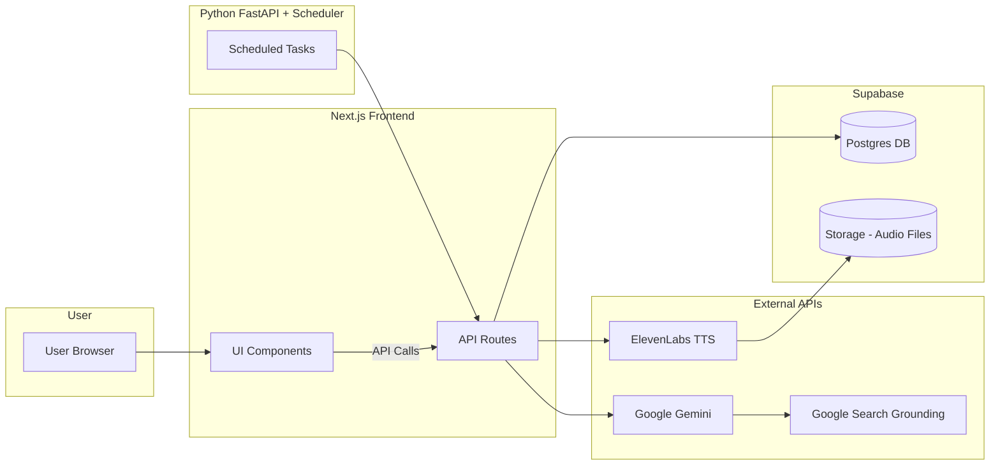

# 📰 Unbiased

_All sides. Your judgment._  
Three angles. One clear view.  

Unbiased is a topic-driven **news shorts web app** that presents multiple perspectives on trending issues.  
Instead of being swayed by one-sided reporting, readers see three concise takes side by side:

- ✅ **For** – Arguments in favor of the topic  
- ❌ **Against** – Counterarguments and criticism  
- ⚖️ **Context / Neutral** – Verified background, facts, and middle-ground insights  

Each summary links back to the **original sources** so readers can verify claims directly.  
Text is also converted into natural-sounding **audio** using ElevenLabs for accessibility and multitasking.

---

## ✨ Features

- 🔍 **Multi-perspective summaries** (For / Against / Context)  
- 📚 **Inline citations & source links** for verification  
- 🎙 **Text-to-Speech integration** (via ElevenLabs)  
- 🤖 **AI-powered article generation** (Google Gemini + Search Grounding)  
- 🗄 **Supabase Database & Storage** for articles and cached audio  
- ⏱ **Scheduled tasks** (Python backend) to refresh daily stories  

---

## 🏗 Tech Stack

### Frontend
- [Next.js 13+](https://nextjs.org/) with TypeScript  
- [TailwindCSS](https://tailwindcss.com/) for styling  

### Backend
- [FastAPI / Python](https://fastapi.tiangolo.com/) for scheduled tasks & API calls  
- [Supabase](https://supabase.com/) (Postgres + Storage)  

### External APIs
- [Google Gemini](https://deepmind.google/technologies/gemini/) – AI summarization  
- Google Search Grounding – factual grounding & citations  
- [ElevenLabs](https://elevenlabs.io/) – Text-to-Speech  

---

## 🔄 System Architecture

